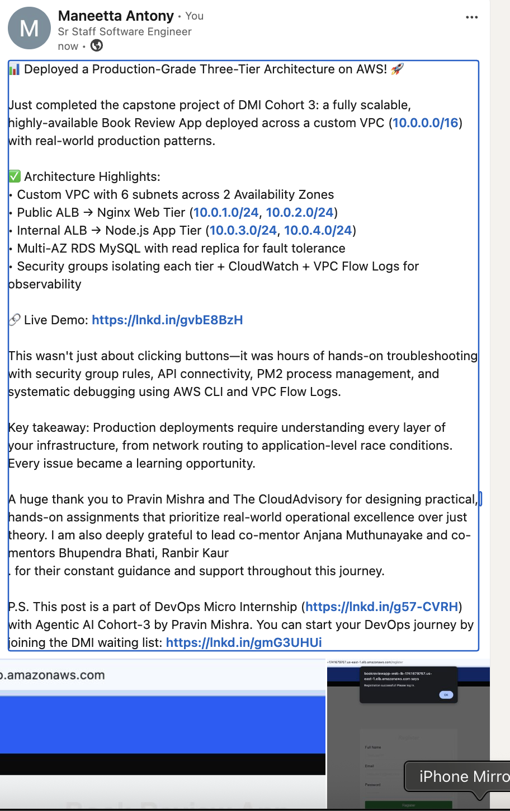

# Assignment 6 — Capstone: Deploy Book Review App (Three-Tier Architecture) on AWS

Part of the DevOps Micro Internship (DMI) Cohort 3 with Agentic AI

---

## Purpose

This is the most important assignment of the course. You will deploy the Book Review App in a fully production-style three-tier architecture on AWS: a Next.js Web Tier behind Nginx and a public ALB, a private Node.js/Express App Tier behind an internal ALB, and a private Multi-AZ MySQL RDS database with a read replica. You are expected to design, deploy, isolate, debug, and document the result independently.

---

# Task 1 — Architecture Diagram

## Goal

Create an architecture diagram showing the custom VPC (10.0.0.0/16), the six subnets across two Availability Zones (two public Web Tier, two private App Tier, two private Database Tier), the public ALB, Web Tier EC2/Nginx, internal ALB, private App Tier EC2, private Multi-AZ RDS with its read replica, and the permitted traffic flow.

### Evidence

#### Diagram image or link

---

# Task 2 — AWS Region & Services Used

## Goal

Record the AWS Region used and list every AWS service used across networking, compute, load balancing, security, and the database.

### Notes

**Region:**

us-east-1

---

**Services used:**

**Networking:**
- Amazon VPC (Virtual Private Cloud)
- Subnets (public and private across multiple Availability Zones)
- Availability Zones - for high availability and fault tolerance
- Security Groups
- Internet Gateway
- NAT Gateway
- Route Tables
- Elastic IP - for NAT Gateway and static public IP addressing
- VPC Flow Logs - for network troubleshooting and traffic analysis

**Compute:**
- Amazon EC2 (Elastic Compute Cloud) - Web Tier and App Tier instances

**Load Balancing:**
- Application Load Balancer (ALB) - public ALB for Web Tier, internal ALB for App Tier
- Target Groups - for routing traffic to EC2 instances in each tier

**Database:**
- Amazon RDS (Relational Database Service) - MySQL with Multi-AZ deployment and read replica
- DB Subnet Group - for managing RDS database instance subnets across Availability Zones

**Monitoring & Logging:**
- Amazon CloudWatch Logs - application and system logs from EC2 instances and ALB access logs

---

# Task 3 — Public Entry Point

## Goal

Confirm the Book Review App loads through the public ALB DNS name.

### Evidence

#### Public ALB DNS

`bookreviewapp-web-lb-1741679757.us-east-1.elb.amazonaws.com`

---

# Task 4 — Evidence Screenshots

## Goal

Capture visual proof of every tier and load balancer.

### Evidence

#### Screenshot 1 — Web Tier EC2 instance in a public subnet

---

#### Screenshot 2 — App Tier EC2 instance in a private subnet

---

#### Screenshot 3 — Public Application Load Balancer configuration or healthy targets

---

#### Screenshot 4 — Internal Application Load Balancer configuration or healthy targets

---

#### Screenshot 5 — Amazon RDS for MySQL showing Multi-AZ and the read replica

---

#### Screenshot 6 — Book Review App UI working through the public ALB

---

# Task 5 — Summary

## Goal

Summarize what worked in the final deployment, the issues encountered and how each was fixed, and the tools or sources used to research and debug.

### Notes

**What worked:**

Component creation and infrastructure setup were smooth due to clear solution documentation. Identifying AWS service configurations and using the provided docs made the initial deployment process straightforward. The three-tier architecture design, VPC setup, subnet configuration, and security group framework all deployed as expected.

---

**Issues encountered and fixes:**

1. **Application Deployment & PM2 Troubleshooting** — Application deployment initially failed. PM2 (process manager) was new, requiring exploration and troubleshooting of application logs and process status to identify failures.

2. **Web ALB to App Tier Connectivity** — Initial security group rules did not enable full connectivity between the Web ALB and backend App servers. Solution: Reviewed and corrected inbound rules for the App Tier security group to allow traffic from the Web ALB.

3. **Bastion Host Access Pattern** — The bastion concept recommended in solution docs did not work with available inbound rules for private App server access. Explored alternative methods and AWS CLI commands to verify connectivity and configurations.

4. **API Proxy & Backend Connectivity** — Backend API requests through the proxy path initially failed due to incomplete security group rules and configuration. Fixed by adjusting ALB target group rules, listener configurations, and verifying security group ingress/egress rules.

5. **Application-Level Issues** — App code had race condition issues causing duplicate record creation and 500 errors. Home page load failures occurred due to API connectivity issues. Used debugging techniques and AWS CLI to verify service attributes, configurations, and behavior.

6. **Root Cause Identification** — The core challenge was identifying why API responses were not accessible through the Web server. Systematic troubleshooting involved enabling VPC Flow Logs for network analysis, invoking AWS CLI commands to inspect service configurations, and iteratively testing connectivity between tiers.

---

**Tools/sources used:**

- **AWS Documentation** — Official AWS docs for VPC, EC2, ALB, RDS, Security Groups, and service configuration best practices
- **AWS CLI** — Used to inspect resource configurations, verify service attributes, and validate security group rules
- **VPC Flow Logs** — Enabled for network troubleshooting and analyzing traffic patterns between application tiers
- **CloudWatch Logs** — Monitored application and system logs for debugging failures and identifying issues
- **Claude Code (AI Assistant)** — Assisted with systematic troubleshooting, provided debugging suggestions, identified root causes, and helped document learning and script commands for future reference
- **PM2 Documentation** — Learned process management, log inspection, and troubleshooting techniques
- **Solution Documentation** — Provided baseline architecture and configuration patterns

---

# LinkedIn Post (Required)

## Goal

Publish a LinkedIn post sharing the capstone deployment, including the public ALB DNS (or a redacted screenshot), three to five lines on what you built and why it is production-style, and one proof screenshot.

## Evidence

#### LinkedIn Post URL

`https://lnkd.in/p/ginaA5Vd`

---

#### Screenshot — Published LinkedIn post

---

# Submission Instructions

- Add all required screenshots and links in your submission
- Do not expose passwords, RDS credentials, connection strings, private keys, or account IDs

---

# Completion Checklist

- [x] Task 1: Architecture diagram completed
- [x] Task 2: AWS Region and services documented
- [x] Task 3: Public ALB DNS confirmed working
- [x] Task 4: All six evidence screenshots captured (Web Tier, App Tier, both ALBs, RDS + replica, app UI)
- [x] Task 5: Deployment summary completed (what worked, issues/fixes, tools/sources)
- [x] LinkedIn post published and URL submitted
- [x] App Tier and Database Tier confirmed not publicly accessible
- [x] No sensitive data exposed

---

## 📌 About DMI & CloudAdvisory

DevOps Micro Internship (DMI) is a project-based DevOps program run by Pravin Mishra (The CloudAdvisory) focused on real-world execution, systems thinking, and career readiness.

It helps learners build strong DevOps foundations with hands-on experience.

---

## 📌 Resources

- 🌐 DMI Official Website: https://dmi.pravinmishra.com?utm_source=github&utm_medium=readme  
- 🎓 University: https://university.pravinmishra.com?utm_source=github&utm_medium=readme  
- 💬 Discord Community: https://discord.pravinmishra.com?utm_source=github&utm_medium=readme  
- 📝 Blog: https://dmi.pravinmishra.com/blog?utm_source=github&utm_medium=readme  
- ▶️ YouTube Playlist: https://www.youtube.com/playlist?list=PLFeSNDtI4Cho  
- 🔗 Pravin Mishra (LinkedIn): https://www.linkedin.com/in/pravin-mishra-aws-trainer/  
- 🏢 CloudAdvisory (LinkedIn): https://www.linkedin.com/company/thecloudadvisory/

---

*This submission is part of DevOps Micro Internship (DMI) Cohort 3 — Agentic AI Track.*
